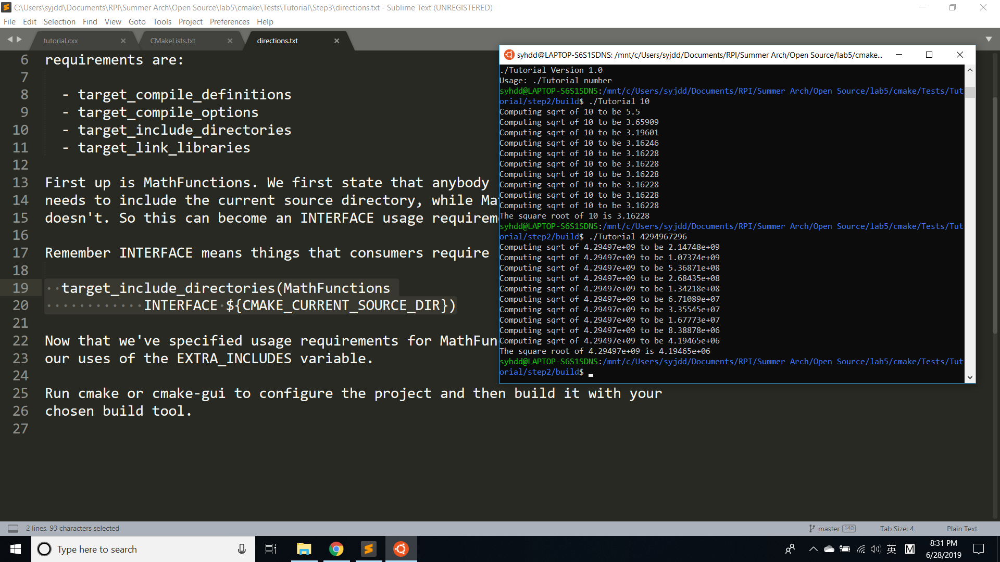
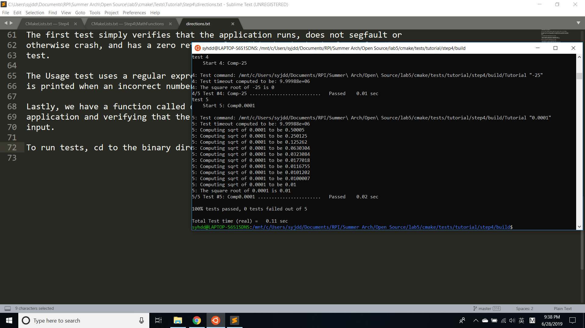
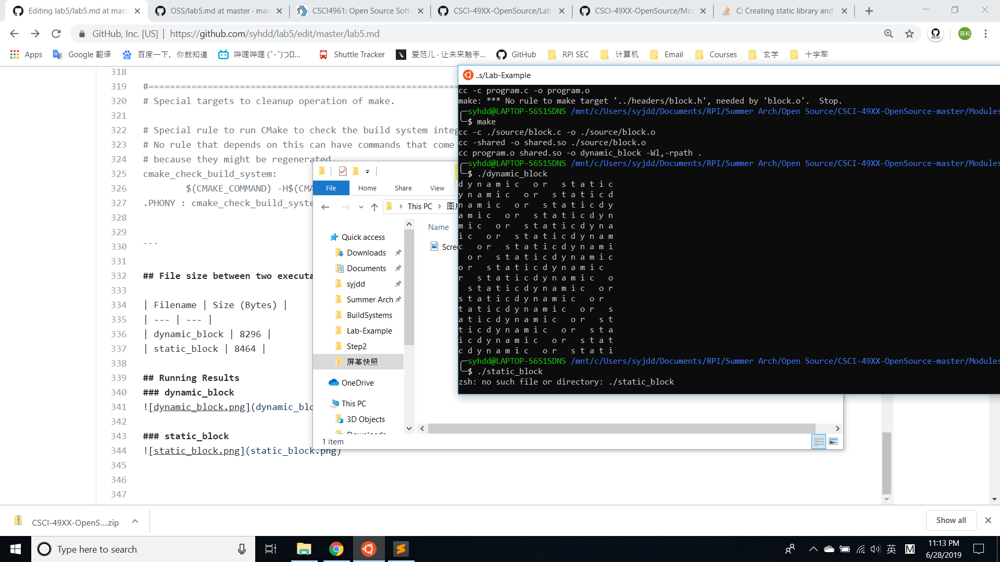
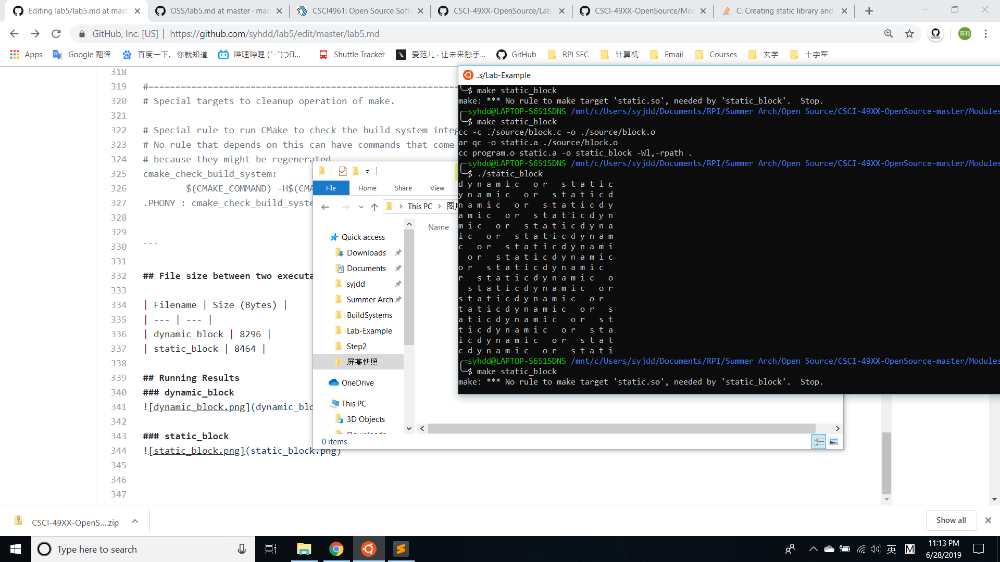

# CMake Tutorial
## Step 1
### Screenshot

## Step 2
### Screenshot

## Step 3
### CMakeLists.txt
Link: [step3/CMakeLists.txt](step3/CMakeLists.txt)
### Screenshot

## Step 4
### CMakeLists.txt
Link: [step4/CMakeLists.txt](step4/CMakeLists.txt)
### MathFunctions/CMakeLists.txt
Link: [step4/MathFunctions/CMakeLists.txt](step4/MathFunctions/CMakeLists.txt)
### Screenshot

## Step 5
### CMakeLists.txt
Link: [step5/CMakeLists.txt](CMakeLists.txt)
### MathFunctions/CMakeLists.txt
Link: [step5/MathFunctions/CMakeLists.txt](step5/MathFunctions/CMakeLists.txt)
### Screenshot

# Lab Example

## My Makefile (Mac OSX)
Link: [Makefile](Makefile)
```make
all: dynamic_block static_block
clean:
	rm *.o *.so *.a dynamic_block static_block	
dynamic_block: program.o shared.so
	cc program.o shared.so -o dynamic_block -Wl,-rpath .
static_block: program.o static.a
	cc program.o static.a -o static_block -Wl,-rpath .
program.o: program.c
	cc -c program.c -o program.o	
block.o: ./source/block.c
	cc -c ./source/block.c -o ./source/block.o
shared.so: block.o
	cc -shared -o shared.so ./source/block.o
static.a: block.o
	ar qc -o static.a ./source/block.o	
program.o: headers/block.h
block.o: ./headers/block.h
```

## CMakeLists.txt
Link: [CMakeLists.txt](CMakeLists.txt)

```cmake
cmake_minimum_required (VERSION 3.3)
project (Exercise)

add_library(shared SHARED ../headers/block.h ../source/block.c)
add_library(static STATIC ../headers/block.h ../source/block.c)

add_executable(dynamic_block ../program.c)
add_executable(static_block ../program.c)

target_link_libraries(dynamic_block shared)
target_link_libraries(static_block static)

```

## CMake Makefile
Link: [CMakefile2](CMakefile2)

```make
# CMAKE generated file: DO NOT EDIT!
# Generated by "Unix Makefiles" Generator, CMake Version 3.10

# Default target executed when no arguments are given to make.
default_target: all

.PHONY : default_target

# Allow only one "make -f Makefile2" at a time, but pass parallelism.
.NOTPARALLEL:


#=============================================================================
# Special targets provided by cmake.

# Disable implicit rules so canonical targets will work.
.SUFFIXES:


# Remove some rules from gmake that .SUFFIXES does not remove.
SUFFIXES =

.SUFFIXES: .hpux_make_needs_suffix_list


# Suppress display of executed commands.
$(VERBOSE).SILENT:


# A target that is always out of date.
cmake_force:

.PHONY : cmake_force

#=============================================================================
# Set environment variables for the build.

# The shell in which to execute make rules.
SHELL = /bin/sh

# The CMake executable.
CMAKE_COMMAND = /usr/bin/cmake

# The command to remove a file.
RM = /usr/bin/cmake -E remove -f

# Escaping for special characters.
EQUALS = =

# The top-level source directory on which CMake was run.
CMAKE_SOURCE_DIR = "/mnt/c/Users/syjdd/Documents/RPI/Summer Arch/Open Source/CSCI-49XX-OpenSource-master/Modules/BuildSystems/Lab-Example"

# The top-level build directory on which CMake was run.
CMAKE_BINARY_DIR = "/mnt/c/Users/syjdd/Documents/RPI/Summer Arch/Open Source/CSCI-49XX-OpenSource-master/Modules/BuildSystems/Lab-Example/build"

#=============================================================================
# Targets provided globally by CMake.

# Special rule for the target edit_cache
edit_cache:
	@$(CMAKE_COMMAND) -E cmake_echo_color --switch=$(COLOR) --cyan "No interactive CMake dialog available..."
	/usr/bin/cmake -E echo No\ interactive\ CMake\ dialog\ available.
.PHONY : edit_cache

# Special rule for the target edit_cache
edit_cache/fast: edit_cache

.PHONY : edit_cache/fast

# Special rule for the target rebuild_cache
rebuild_cache:
	@$(CMAKE_COMMAND) -E cmake_echo_color --switch=$(COLOR) --cyan "Running CMake to regenerate build system..."
	/usr/bin/cmake -H$(CMAKE_SOURCE_DIR) -B$(CMAKE_BINARY_DIR)
.PHONY : rebuild_cache

# Special rule for the target rebuild_cache
rebuild_cache/fast: rebuild_cache

.PHONY : rebuild_cache/fast

# The main all target
all: cmake_check_build_system
	$(CMAKE_COMMAND) -E cmake_progress_start "/mnt/c/Users/syjdd/Documents/RPI/Summer Arch/Open Source/CSCI-49XX-OpenSource-master/Modules/BuildSystems/Lab-Example/build/CMakeFiles" "/mnt/c/Users/syjdd/Documents/RPI/Summer Arch/Open Source/CSCI-49XX-OpenSource-master/Modules/BuildSystems/Lab-Example/build/CMakeFiles/progress.marks"
	$(MAKE) -f CMakeFiles/Makefile2 all
	$(CMAKE_COMMAND) -E cmake_progress_start "/mnt/c/Users/syjdd/Documents/RPI/Summer Arch/Open Source/CSCI-49XX-OpenSource-master/Modules/BuildSystems/Lab-Example/build/CMakeFiles" 0
.PHONY : all

# The main clean target
clean:
	$(MAKE) -f CMakeFiles/Makefile2 clean
.PHONY : clean

# The main clean target
clean/fast: clean

.PHONY : clean/fast

# Prepare targets for installation.
preinstall: all
	$(MAKE) -f CMakeFiles/Makefile2 preinstall
.PHONY : preinstall

# Prepare targets for installation.
preinstall/fast:
	$(MAKE) -f CMakeFiles/Makefile2 preinstall
.PHONY : preinstall/fast

# clear depends
depend:
	$(CMAKE_COMMAND) -H$(CMAKE_SOURCE_DIR) -B$(CMAKE_BINARY_DIR) --check-build-system CMakeFiles/Makefile.cmake 1
.PHONY : depend

#=============================================================================
# Target rules for targets named static_block

# Build rule for target.
static_block: cmake_check_build_system
	$(MAKE) -f CMakeFiles/Makefile2 static_block
.PHONY : static_block

# fast build rule for target.
static_block/fast:
	$(MAKE) -f CMakeFiles/static_block.dir/build.make CMakeFiles/static_block.dir/build
.PHONY : static_block/fast

#=============================================================================
# Target rules for targets named dynamic_block

# Build rule for target.
dynamic_block: cmake_check_build_system
	$(MAKE) -f CMakeFiles/Makefile2 dynamic_block
.PHONY : dynamic_block

# fast build rule for target.
dynamic_block/fast:
	$(MAKE) -f CMakeFiles/dynamic_block.dir/build.make CMakeFiles/dynamic_block.dir/build
.PHONY : dynamic_block/fast

#=============================================================================
# Target rules for targets named shared

# Build rule for target.
shared: cmake_check_build_system
	$(MAKE) -f CMakeFiles/Makefile2 shared
.PHONY : shared

# fast build rule for target.
shared/fast:
	$(MAKE) -f CMakeFiles/shared.dir/build.make CMakeFiles/shared.dir/build
.PHONY : shared/fast

#=============================================================================
# Target rules for targets named static

# Build rule for target.
static: cmake_check_build_system
	$(MAKE) -f CMakeFiles/Makefile2 static
.PHONY : static

# fast build rule for target.
static/fast:
	$(MAKE) -f CMakeFiles/static.dir/build.make CMakeFiles/static.dir/build
.PHONY : static/fast

program.o: program.c.o

.PHONY : program.o

# target to build an object file
program.c.o:
	$(MAKE) -f CMakeFiles/static_block.dir/build.make CMakeFiles/static_block.dir/program.c.o
	$(MAKE) -f CMakeFiles/dynamic_block.dir/build.make CMakeFiles/dynamic_block.dir/program.c.o
.PHONY : program.c.o

program.i: program.c.i

.PHONY : program.i

# target to preprocess a source file
program.c.i:
	$(MAKE) -f CMakeFiles/static_block.dir/build.make CMakeFiles/static_block.dir/program.c.i
	$(MAKE) -f CMakeFiles/dynamic_block.dir/build.make CMakeFiles/dynamic_block.dir/program.c.i
.PHONY : program.c.i

program.s: program.c.s

.PHONY : program.s

# target to generate assembly for a file
program.c.s:
	$(MAKE) -f CMakeFiles/static_block.dir/build.make CMakeFiles/static_block.dir/program.c.s
	$(MAKE) -f CMakeFiles/dynamic_block.dir/build.make CMakeFiles/dynamic_block.dir/program.c.s
.PHONY : program.c.s

source/block.o: source/block.c.o

.PHONY : source/block.o

# target to build an object file
source/block.c.o:
	$(MAKE) -f CMakeFiles/shared.dir/build.make CMakeFiles/shared.dir/source/block.c.o
	$(MAKE) -f CMakeFiles/static.dir/build.make CMakeFiles/static.dir/source/block.c.o
.PHONY : source/block.c.o

source/block.i: source/block.c.i

.PHONY : source/block.i

# target to preprocess a source file
source/block.c.i:
	$(MAKE) -f CMakeFiles/shared.dir/build.make CMakeFiles/shared.dir/source/block.c.i
	$(MAKE) -f CMakeFiles/static.dir/build.make CMakeFiles/static.dir/source/block.c.i
.PHONY : source/block.c.i

source/block.s: source/block.c.s

.PHONY : source/block.s

# target to generate assembly for a file
source/block.c.s:
	$(MAKE) -f CMakeFiles/shared.dir/build.make CMakeFiles/shared.dir/source/block.c.s
	$(MAKE) -f CMakeFiles/static.dir/build.make CMakeFiles/static.dir/source/block.c.s
.PHONY : source/block.c.s

# Help Target
help:
	@echo "The following are some of the valid targets for this Makefile:"
	@echo "... all (the default if no target is provided)"
	@echo "... clean"
	@echo "... depend"
	@echo "... static_block"
	@echo "... edit_cache"
	@echo "... dynamic_block"
	@echo "... rebuild_cache"
	@echo "... shared"
	@echo "... static"
	@echo "... program.o"
	@echo "... program.i"
	@echo "... program.s"
	@echo "... source/block.o"
	@echo "... source/block.i"
	@echo "... source/block.s"
.PHONY : help


#=============================================================================
# Special targets to cleanup operation of make.

# Special rule to run CMake to check the build system integrity.
# No rule that depends on this can have commands that come from listfiles
# because they might be regenerated.
cmake_check_build_system:
	$(CMAKE_COMMAND) -H$(CMAKE_SOURCE_DIR) -B$(CMAKE_BINARY_DIR) --check-build-system CMakeFiles/Makefile.cmake 0
.PHONY : cmake_check_build_system


```

## File size between two executables

| Filename | Size (Bytes) |
| --- | --- |
| dynamic_block | 8296 |
| static_block | 8464 |

## Running Results
### dynamic_block


### static_block



